

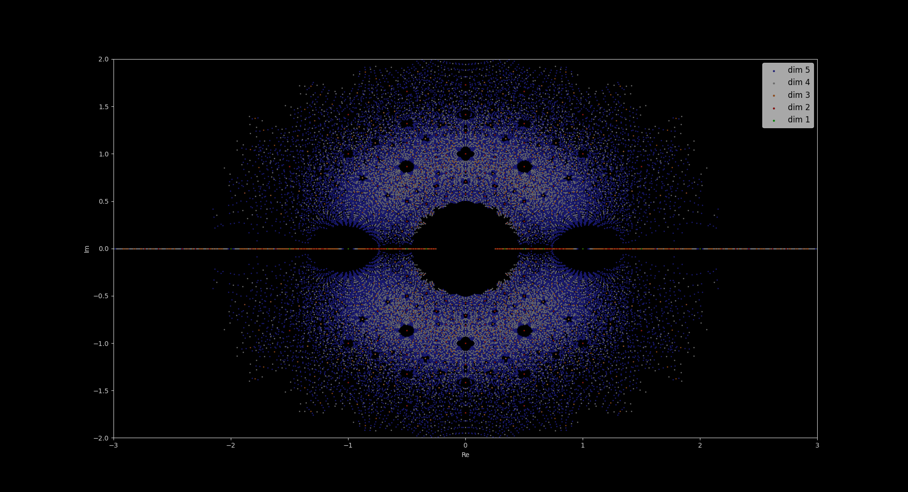

"*Traditionnellement, on distingue trois types de “qualités” ou d’“aspects” des choses de l’Univers, qui soient objet de la réflexion mathématique : ce sont le nombre, la grandeur, et la forme. On peut aussi les appeler l’aspect “arithmétique”, l’aspect “métrique” (ou “analytique”), et l’aspect “géométrique” des choses.*"
Récoltes et Semailles, Alexander Grothendieck 1983~1986.

I am <a href="https://rehan-malak.github.io/">Rehan MALAK</a>. You can reach me by mail at FIRST.LAST AT gmail.com   (<a href="https://rehan-malak.github.io/gpg/rehan_2024.asc">GPG</a>)

This is a WIP blog about mathematics and cryptanalysis...

For now, only some Pictures.

# Pictures

###  Gauss

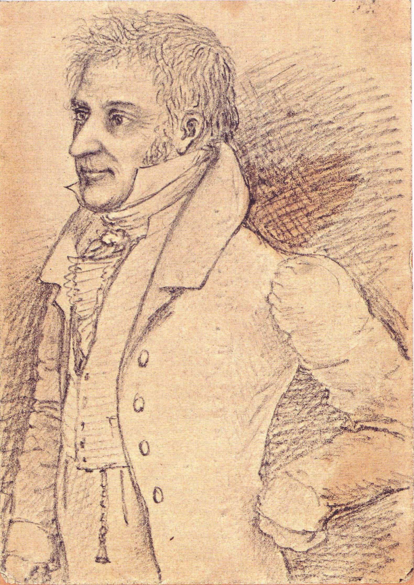

###  Galois

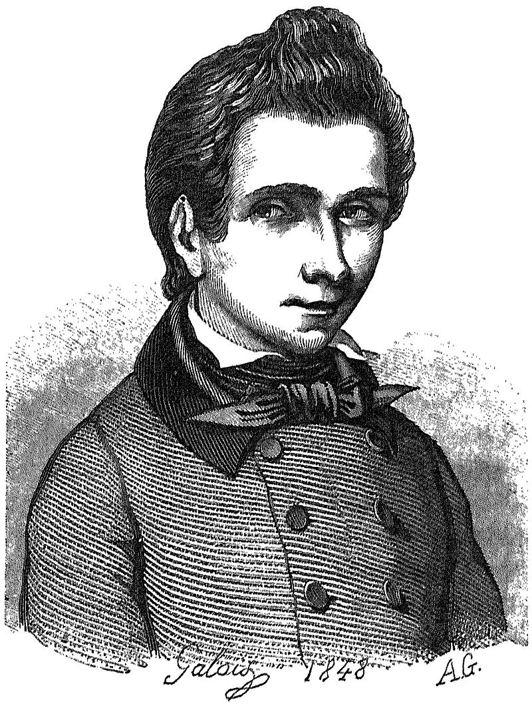

###  Riemann

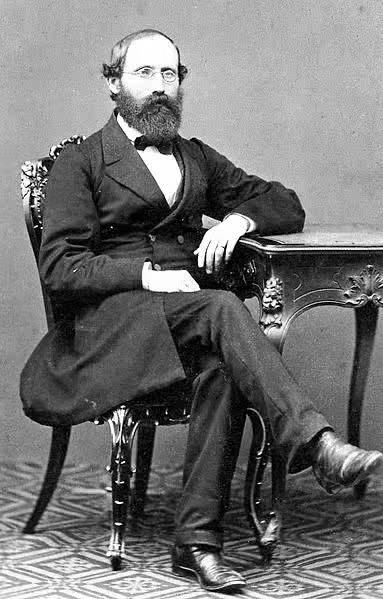

###  Poincaré (Solvay)

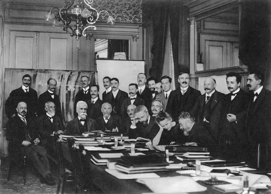

###  Hilbert

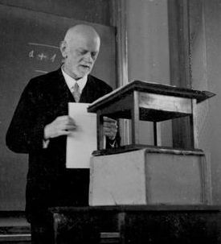

###  Noether

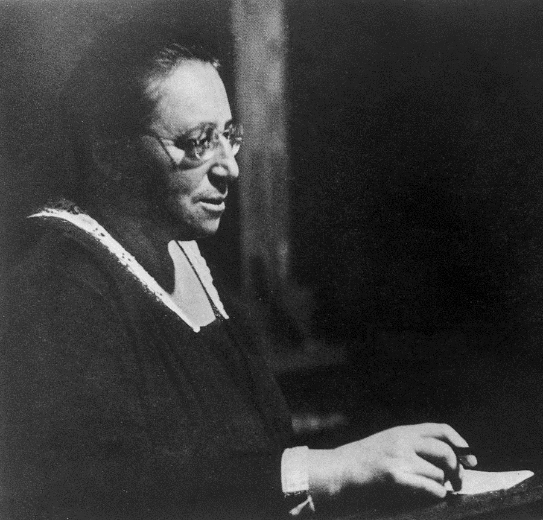

###  Tamagawa-Serre-Taniyama-Weil

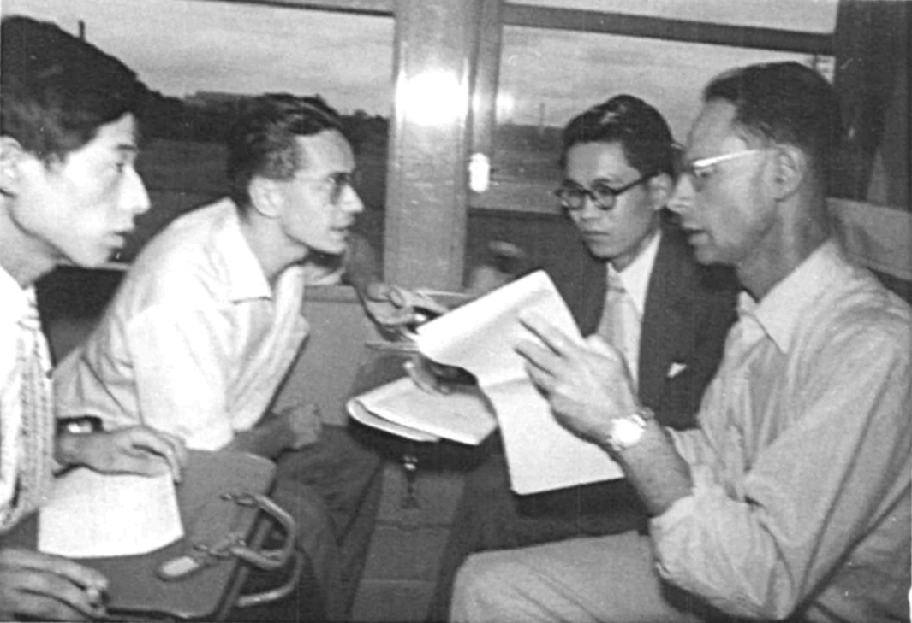

### Godement-Dieudonné-Weil-MacLane-Serre

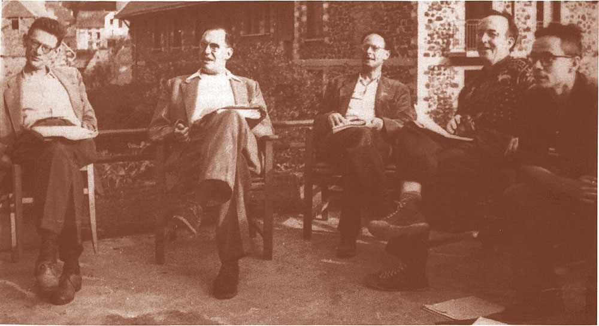

### Serre-Grothendieck

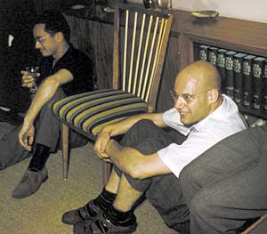

### SGA

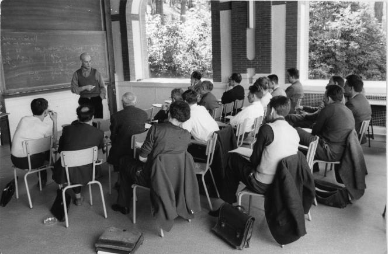

### Deligne

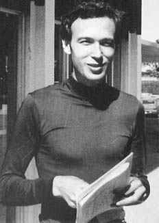

### Shimura

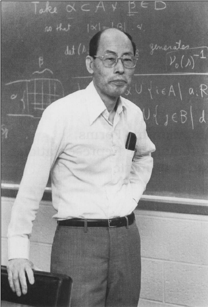

### Langlands

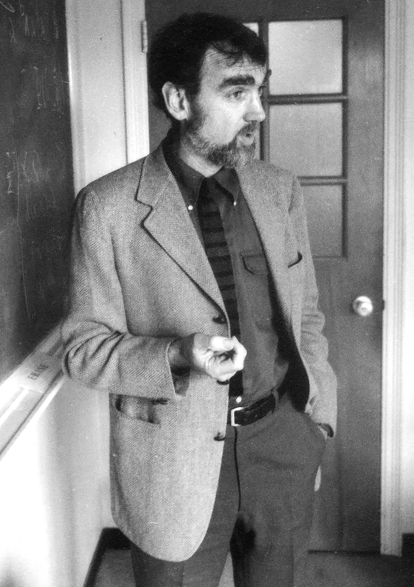

### Lusztig-Quillen-Segal-Atiyah

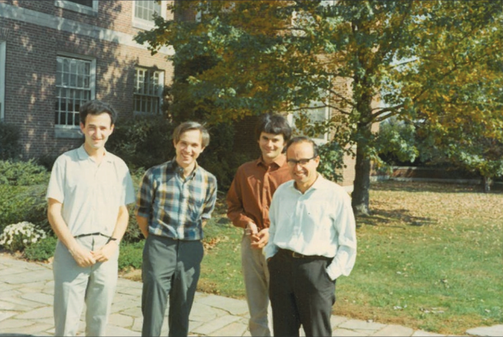

### Bott-Tate-Serre

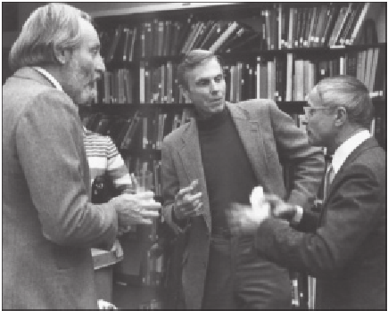

### Zagier-Serre

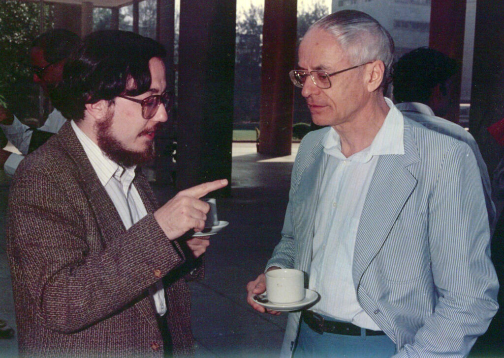

### Mazur-Fontaine-R?

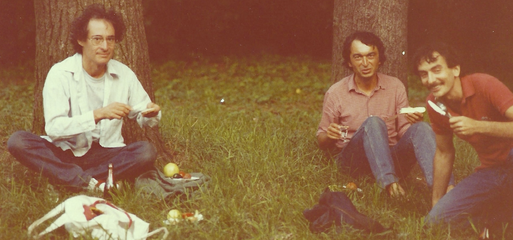

### Wiles-Ribet

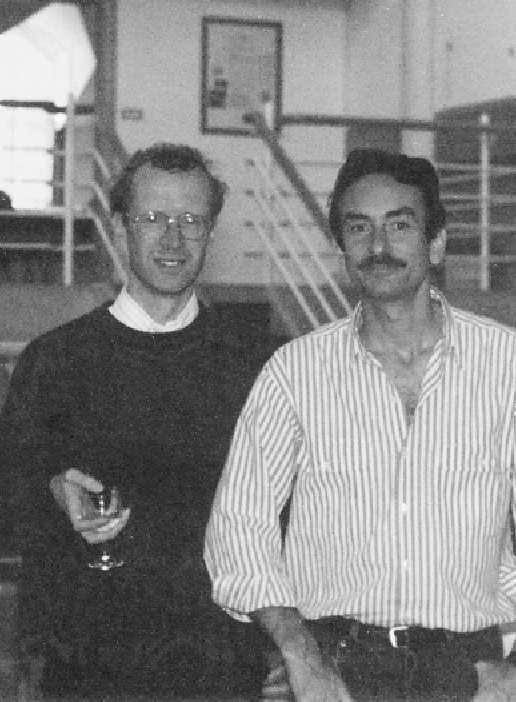

### Beilinson-Drinfeld

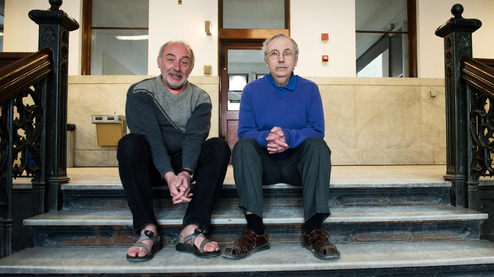

### Voevodsky-?-Kontsevich-?-?

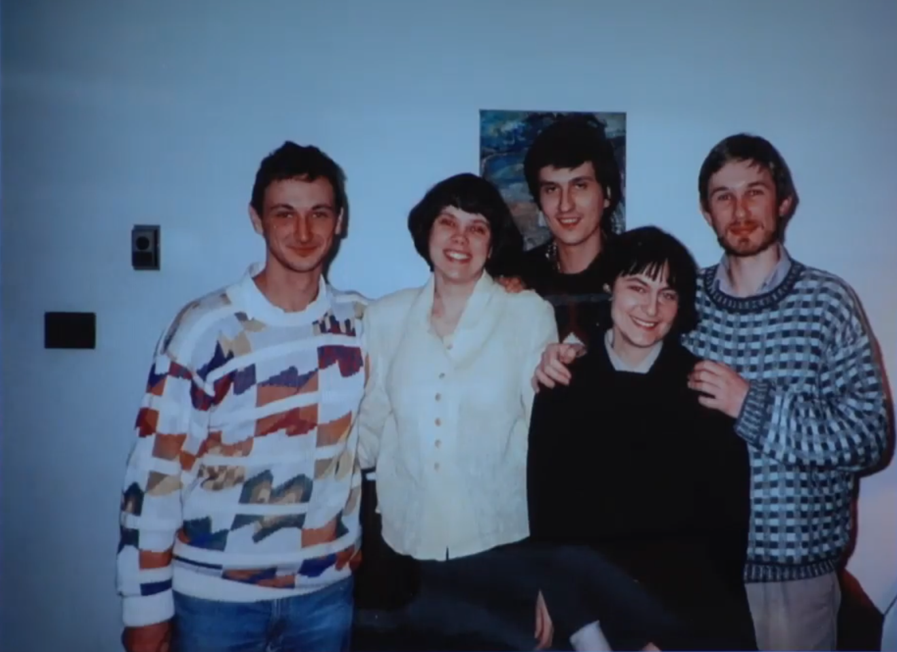

### Arthur-Laumon-BaoChâu

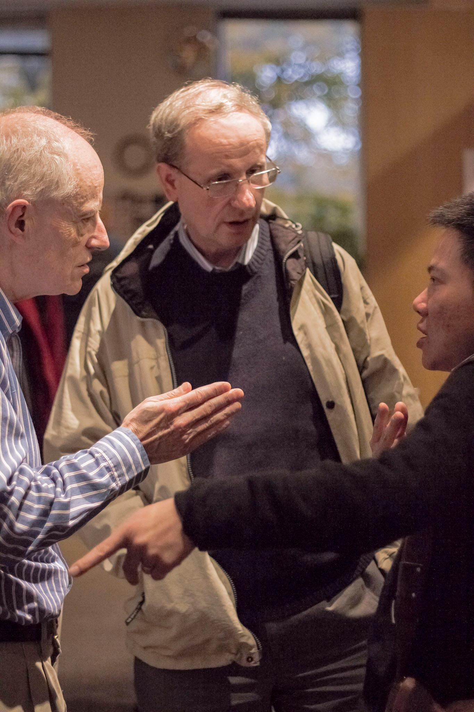

### Bhatt-Faltings-Caraiani-Scholze

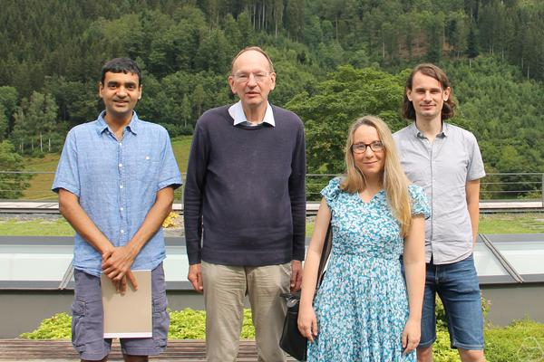

